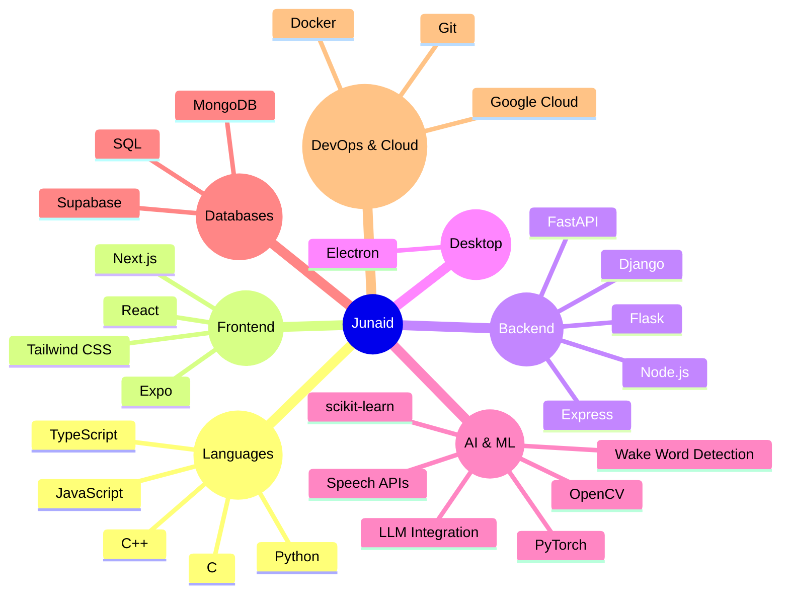

# Hi, I'm Junaid 👋

CS student building AI-powered tools and figuring out what it takes to ship them properly.

 

### Tech Snapshot

```mermaid
mindmap
  root((Junaid))
    ((Languages))
      Python
      JavaScript
      TypeScript
      C
      C++
    ((Frontend))
      React
      Expo
      Tailwind CSS
      Next.js
    ((Backend))
      Node.js
      Express
      Django
      Flask
      FastAPI
    ((Desktop))
      Electron
    ((AI & ML))
      LLM Integration
      Speech APIs
      Wake Word Detection
      PyTorch
      OpenCV
      scikit-learn
    ((Databases))
      MongoDB
      Supabase
      SQL
    ((DevOps & Cloud))
      Docker
      Git
      Google Cloud
```

##  Connect

 

